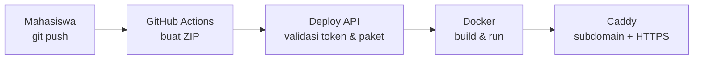

# AutoDeploy

MVP **Platform as a Service (PaaS) sederhana** untuk praktikum mata kuliah Layanan dan Sistem Virtual.

Alurnya:

1. Mahasiswa melakukan `git push` ke GitHub.
2. GitHub Actions membuat arsip ZIP aplikasi PHP Native.
3. Workflow mengirim ZIP ke Deploy API pada VPS.
4. VPS memvalidasi paket, membangun image, dan menjalankan container Docker.
5. Aplikasi dapat dibuka melalui subdomain `nama-proyek.domain-kampus`.

> Proyek ini dibuat untuk pembelajaran. Gunakan pada VPS praktikum yang terisolasi; jangan langsung menjadikannya layanan hosting publik multi-tenant.

## Arsitektur



## Yang dipelajari

- VPS sebagai mesin virtual pada penyedia cloud
- SSH, DNS, port, dan reverse proxy
- Continuous Deployment dengan GitHub Actions
- Container, image, dan isolasi resource
- Secret/token dan validasi input
- Health check, log, dan rollback sederhana

## Cara tercepat: demo gratis di VirtualBox

Tidak perlu membeli VPS. Siapkan Ubuntu Server 24.04 di VirtualBox, kemudian jalankan:

```bash
git clone https://github.com/NourAnisa/autodeploy.git
cd autodeploy
sudo bash server/install-local.sh
bash examples/deploy-local.sh demo-app examples/php-native
```

Panduan lengkap: [Demo gratis dengan VirtualBox](docs/VIRTUALBOX.md).

## Kebutuhan

### VPS

Rekomendasi kelas kecil:

- Ubuntu Server 24.04 LTS
- 2 vCPU
- RAM 4 GB
- Disk NVMe 40–50 GB
- IPv4 publik
- Port 22, 80, dan 443 terbuka

Untuk satu atau dua aplikasi demo, 1 vCPU dan RAM 2 GB masih dapat dipakai. Jangan memasang Ollama/Hermes pada VPS yang sama karena model AI dapat menghabiskan RAM dan mengganggu build container.

### Domain

Siapkan dua DNS record yang menuju IPv4 VPS:

| Type | Name | Value |
|---|---|---|
| A | `deploy.lab` | IP VPS |
| A | `*.lab` | IP VPS |

Contoh bila domain utama `kampus.ac.id`, gunakan base domain `lab.kampus.ac.id`. Deploy API berada di `deploy.lab.kampus.ac.id`, sedangkan aplikasi mahasiswa berada di `nama-proyek.lab.kampus.ac.id`.

## Instalasi server

Masuk ke VPS, lalu jalankan:

```bash
sudo apt update
sudo apt install -y git
git clone https://github.com/NourAnisa/autodeploy.git
cd autodeploy
sudo bash server/install.sh lab.kampus.ac.id
```

Ganti `lab.kampus.ac.id` dengan base domain milik Anda. Installer akan memasang Docker, PHP-FPM, Caddy, unzip, dan curl; membuat Deploy API; serta menghasilkan token acak.

Di akhir instalasi, salin token yang ditampilkan. Token juga tersimpan di `/etc/autodeploy/token` dan hanya dapat dibaca oleh root.

## Menyiapkan repository aplikasi mahasiswa

1. Salin `examples/workflows/deploy.yml` ke repository aplikasi sebagai `.github/workflows/deploy.yml`.
2. Buka **Settings → Secrets and variables → Actions**.
3. Tambahkan secrets berikut:

| Secret | Contoh |
|---|---|
| `DEPLOY_URL` | `https://deploy.lab.kampus.ac.id/deploy.php` |
| `DEPLOY_TOKEN` | token dari installer |
| `PROJECT_SLUG` | `kelompok-01` |

4. Push file PHP ke branch `main`.
5. Pantau proses pada tab **Actions**.
6. Buka `https://kelompok-01.lab.kampus.ac.id`.

Nama proyek hanya boleh berisi huruf kecil, angka, dan tanda hubung, dengan panjang 3–40 karakter.

## Uji lokal aplikasi

```bash
docker build -f server/templates/php-native/Dockerfile -t php-demo examples/php-native
docker run --rm -p 8080:80 php-demo
```

Buka `http://localhost:8080`.

## Batas keamanan MVP

MVP ini menerapkan bearer token, batas ukuran paket, pencegahan ZIP path traversal, health check, binding container ke localhost, dan batas CPU/RAM/PID. Namun satu token masih dipakai bersama dan aplikasi mahasiswa tetap merupakan kode tidak tepercaya.

Sebelum dipakai sebagai layanan publik, tambahkan akun/token per mahasiswa, audit log, antrean deployment, pemindaian dependency, kuota image, rate limiting, backup, dan isolasi VM/namespace per tenant.

## Struktur repository

```text
.
├── README.md
├── server
│   ├── install.sh
│   ├── install-local.sh
│   ├── public/deploy.php
│   ├── bin/autodeploy-project
│   └── templates/php-native/Dockerfile
└── examples
    ├── deploy-local.sh
    ├── workflows/deploy.yml
    └── php-native/index.php
```

## Bahan ajar

- [Demo gratis dengan VirtualBox](docs/VIRTUALBOX.md)
- [Modul praktikum lengkap](docs/PRAKTIKUM.md)
- [Panduan troubleshooting](docs/TROUBLESHOOTING.md)

## Skenario praktikum 100 menit

| Waktu | Kegiatan |
|---:|---|
| 10 menit | Mengenali VPS, IP publik, DNS, dan port |
| 15 menit | Meninjau arsitektur serta risiko keamanan |
| 20 menit | Menyiapkan secrets dan workflow |
| 20 menit | Push aplikasi dan mengamati GitHub Actions |
| 20 menit | Memeriksa container, log, port, dan reverse proxy |
| 15 menit | Mengubah aplikasi, redeploy, refleksi |

Perintah observasi di VPS:

```bash
docker ps
docker stats --no-stream
sudo journalctl -u caddy -n 50 --no-pager
sudo tail -n 50 /srv/autodeploy/logs/deployments.log
```

## Lisensi

MIT
